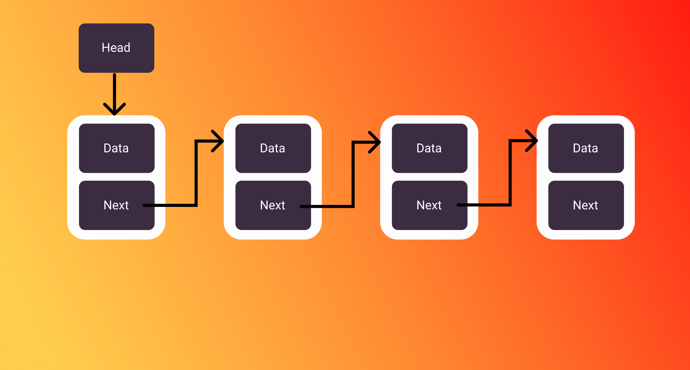

# Data Structure 101: LinkedList  


### Agenda

1. Why do we need LinkedList?
2. What is LinkedList?
3. How does LinkedList Store data?
4. What is Generic Programming? 
5. What are boundary conditions we need to take care of?
6. How does addFirst() work?
7. How does addLast() work?
8. How does removeFirst() work?
9. How does removeLast() work?
10. How does remove() work?
11. How does find() work?
12. Conclusion


### 1. Why do we need LinkedList?
Many of us are familiar with array as a data structure. An array is an amazing data structure because:
1. It supports random access to the element. means you can access any element in the array with constant time O(1).
2. Easy to implement and easy to learn.
3. Array store elements with reference to indexes that make it more flexible to work with.

With all these advantages there is one thing that array is not capable of is dynamic in size.

> Arrays are fixed in size.  

Although you can make a dynamic array like double the size when an array is in an overflow state. But it is not come out of the box especially in low-level languages. Some high-level language does implement dynamic array like Java provides `ArrayList` API and python has `list` API.
This limitation can be overcome with LinkedList. I think this is the only reason we should need LinkedList. Let understand it by an example, So you are the boss of your company as a boss you need to take care of your employees since you don't know about LinkedList you store the information(Objects of Employee) in an array. Now you can easily access information about your employees, and you are happy.  

```java
//Your employee class should look like this
class Employee{
     int id;
     String name;
     .
     .
     .
}
// you store them in an array and you have 100 employee.
Employee[] arrayOfEmployee = new Employee[100]();  
arrayOfEmployee[id] = new Employee(...);
now you can access the employee with their id;
```

This worked fine for you until you got a big client and you need to hire more employees. let say you have hired five people. because you are a good boss you need to store their information as well. Now you run into the problem. Initially, you only have 100 employees and you have created 100 indexes for your employee. A short and quick solution to this problem is to create a second array of size more than the first array(100+5) copy(expensive task) all the elements from the first array to the second array and you are good to go. until you got another big client and you need to hire some more employees. Now you understand the drawback of the array clearly, let see what LinkedList has to say about the same problem.

### 2. What is LinkedList?



So LinkedList stores information in a Node. A Node is a collection of data and pointer point to the next Node. That it. Now if you look into your problem related to storing Employee information it seems like already solve. now you can hire as many employees as you can. And not worry about how to store them because you just need to insert a new Employee(Node) into the existing LinkedList. No more copying from one array to another.

### 3. How does LinkedList Store data?

As discuss above LinkedList stores data in a node. Every Node has two-part first part is data itself and send part a pointer that point to next similar node and sequence goes up to where the end node point to null. Before we discuss how LinkedList is store in computer memory let me introduce you to our friend "head".

> Head is the pointer that points to the first Node of our LinkedList. why?

Have you wondered what happens to the variable that goes out of scope? Those variables are [garbage collected](https://en.wikipedia.org/wiki/Garbage_collection_(computer_science)). Garbage collection is a concept introduce by many high-level languages to overcome memory leakage issues. under the hood, if a variable is not pointed by any of the pointers(referenced) then the variables are going to garbage collected. And we don't want our sweet Employee information to be garbage collected. So we need one reference(head) that points to the first node since the first node is pointing to the next node we don't need any extra reference that points to the next node.
At the hardware level, A Node takes a chunk of heap memory and store data and pointers. Since every chunk of heap memory has to be referenced otherwise garbage collectors will come and collect all the memory that's why we need to head pointer. But we need to be careful because whoever has access to our head pointer can have access to all our Employee information. so we need to make it private(Access Specifier) so that other classes don't have access to it.

### 4. What is Generic programming?

It is a fancy way of saying that our data structure will work no matter what kind of data you want to store and operate with. for e.g. in the previous we saw that why we need LinkedList, in a similar way what if your business expanded and you need to create new department who deal with shipping of your product in that case you also need to store the worker information who work with the new department. Because you are a Good Boss you need to find a way to store information. So you come with a solution that what if our LinkedList can store both kinds of employee objects. That is Generic Programming. In case you need more information refer to [this](https://en.wikipedia.org/wiki/Generic_programming) link.

### 5. What are boundary conditions we need to take care of?
